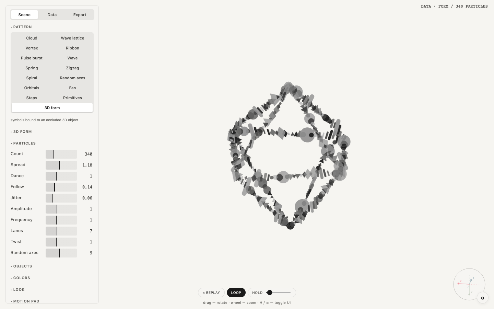

  

<h1 align="center">Particle Dance</h1>

  Particles that dance along patterns and 3D forms 
  one HTML file · runs in the browser · no install · free and open source

  <a href="https://robvagin-beep.github.io/particle-dance/"><b>Open Particle Dance</b></a> ·
  <a href="#run-it">Run it</a> ·
  <a href="#more-tools">More tools</a>

---

A field of small symbols that never stands still. Pick a pattern, bind it to a solid, feed it a few numbers and let it move.

## What it does

- **15 patterns:** cloud, wave lattice, vortex, ribbon, pulse burst, wave, spring, zigzag, spiral, random axes, orbitals, fan, steps, primitives and 3D form
- **3D form:** symbols bind to the edges of an octahedron, a cube, a tetrahedron, a pyramid or an icosahedron, with the back faces hidden
- **Data in:** a few numbers scale the color groups and set a label on the canvas
- **Motion pad** for tempo and character, a free 3D camera, a seed for repeatable results
- **Export:** PNG, a JSON config, a standalone HTML file or an embed iframe

## Run it

Open [robvagin-beep.github.io/particle-dance](https://robvagin-beep.github.io/particle-dance/), or download `index.html` and open it from your disk. It is the whole tool: no build step, no dependencies, no network. Press **H** to hide the panel.

## Made by a designer

I'm a designer. I build small tools like this for my own work, with AI agents: I make the decisions, Claude Code writes the code. The panels follow one grammar across the whole set.

Take it if you want it.

## More tools

- [Murmur](https://github.com/robvagin-beep/murmur-vj) · a VJ visualizer: circles, triangles and squares that move to your music
- [Orbital](https://github.com/robvagin-beep/orbital) · data as orbits, axes or a bending mesh
- [Metaballs](https://github.com/robvagin-beep/metaballs) · soft masses that merge, split and leave holes
- [Halftone Cloud](https://github.com/robvagin-beep/halftone-cloud) · images rebuilt as a halftone of flying shapes
- [Logomachine](https://github.com/robvagin-beep/logomachine) · seeded generative marks: one seed, one pattern, always
- [Motion Primer](https://github.com/robvagin-beep/motion-primer) · bodies with behaviors: swarm, pack, magnet, orbit, fall, scatter
- [Particles 3D](https://github.com/robvagin-beep/particles-3d) · a WebGL2 cloud of up to 300,000 particles
- [Pixel Ring](https://github.com/robvagin-beep/pixel-ring) · rings drawn in pixels
- [Motion Pad](https://github.com/robvagin-beep/motion-pad) · one pad for the character of motion

## License

[MIT](LICENSE) © 2026 Robert Vagin
